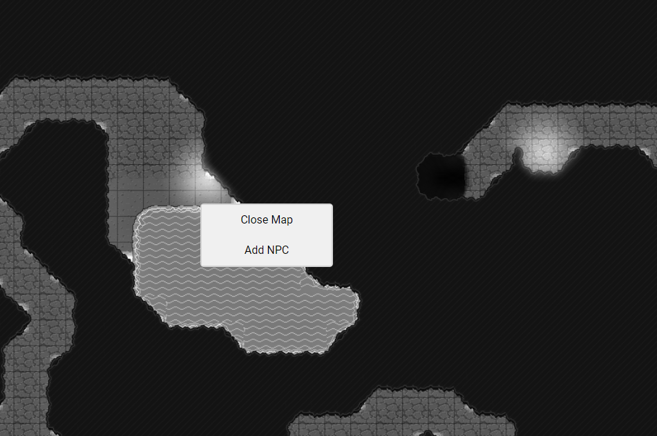

## DM Basics
This section assumes a general knowledge of playing D&D.

## Getting Players in the Session
To allow players to join your session, just send them the share link (top of the screen). This is the same as the URL that shows up in your browser, so you could use that too. If you set a password for the session, make sure you send that to your players as well. Once they join, they will be prompted to enter a name, and a password if you set one. They can input any name they want, and they can change it later.

## Map Management

### Loading Maps
To load a map, click the **Manage Maps** icon at the bottom left of your screen, above the settings icon. This will open a window in which you can set the grid columns and rows of your map, as well as the size of each grid square in feet. Once you've set these numbers to your liking, click **Load New Map** to load a map image from your computer. 

If this succeeds, the map image will appear above the input boxes in the map manager window. Hovering over this image will show you the grid dimensions and square size of the map. Clicking this map will show three buttons, in order from left to right:

- Remove Map: Removes the map and all of its data from the game. Do this if you don't plan on using a map again for a while, as it helps free up space.
- Place Map: Places the map on the main map display. This is probably what you want to do right about now.
- Change Map Dimensions and Grid Size: Clicking this sets the map's grid dimensions and size to the values in the input boxes.

### Using Placed Maps
Once a map is placed, you can right-click on it to display a few options, as shown below.

**Close Map:** This removes the map from the display area. However, it can still be accessed from the Map Manager, and any NPCs on it will retain their data unless you remove it altogether using the Map Manager.

**Add NPC:** This adds an NPC to the map at your cursor's position. See the [NPCs section](dm_npcs.html) for more information.

Maps can be moved around on your screen by selecting the **Move** icon on the upper right side of your screen. Once you have selected that, your cursor will become a Move cursor over maps and NPCs, signifying that you can move them around.

### Fog of War
To activate Fog of War editing, select the Cloud icon at the top right of your screen. Your cursor will then become a **+** shape over maps. If you drag your cursor across a map, it will create a transparent blue selection box, showing where the obscuration rectangle will be placed. When you're satisfied with the size of your obscuration rectangle, release your mouse and it will be placed on the map. To remove an obscuration rectangle, just click it while the Obscuration cursor is active.

## Saving Sessions
Sessions can be saved with the **Save Session** button on the bottom left of your screen. Clicking this will download a file named *session.json* to your computer, which you can then use with the **Load Session** button on the home screen.