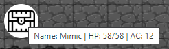

# NPCs & Homebrew
This section assumes a general knowledge of playing D&D, and of [CritterDB](https://critterdb.com/).

## Loading NPCs
To load an NPC, right-click on an active map and click **Add NPC**. This will open up a dialog with a search bar, which you can enter the name of the monster you want to add. By default, Xorien's Lair uses monster information from the [Open5e](https://open5e.com/) API, so monsters from the SRD and several other sources can be found in the NPC menu.

Once you've found the monster you want to use, click it (not the blue link, that will lead to the open5e page) and its information will autofill into the boxes at the bottom of the dialog. If you want to change its name, icon, or starting HP, you can do that through that interface. To upload a custom NPC icon, click the farthest-left icon (a cloud with an up arrow inside it). This will open a file open dialog, from which you can choose the file you want to upload. Once you've set everything you want to set for the NPC, clicking **Create NPC** will place the NPC in the spot you right-clicked on the map.

## Using NPCs
NPCs can be moved by selecting the **Move** cursor in the top right of your screen. They will lock to the nearest grid square to where you drag them to, and are confined by the map's edges.

Right-clicking an NPC will provide you with the following options:
- Remove NPC - This removes the NPC from the map, and clears its data.
- Roll Initiative - This adds the NPC to the initiative order. For more information on combat, see the [DM Combat](dm_combat.html) section.

Hovering over NPCs on the map will show their name, current HP, and AC, as shown below:

## Homebrew Creatures
If you want to import a creature or full bestiary from CritterDB, click the top ghost icon on the bottom left of your screen, labelled **Load CritterDB Homebrew**. This will open a dialog where you can enter the URL of a creature or bestiary on CritterDB. Make sure the creature or bestiary is link-shareable, as this feature will not work otherwise. Once you've input your link, click **Load Critter**. If your bestiary or creature was found, you will recieve a notification that indicates how many creatures were fetched from CritterDB.

Creatures that you get from CritterDB can be found in the **Add NPC** search results, and can be deleted from there if needed.

To reload your bestiaries, click the second ghost icon labelled **Reload CritterDB Homebrews**. This will reload all of your loaded homebrew creatures.